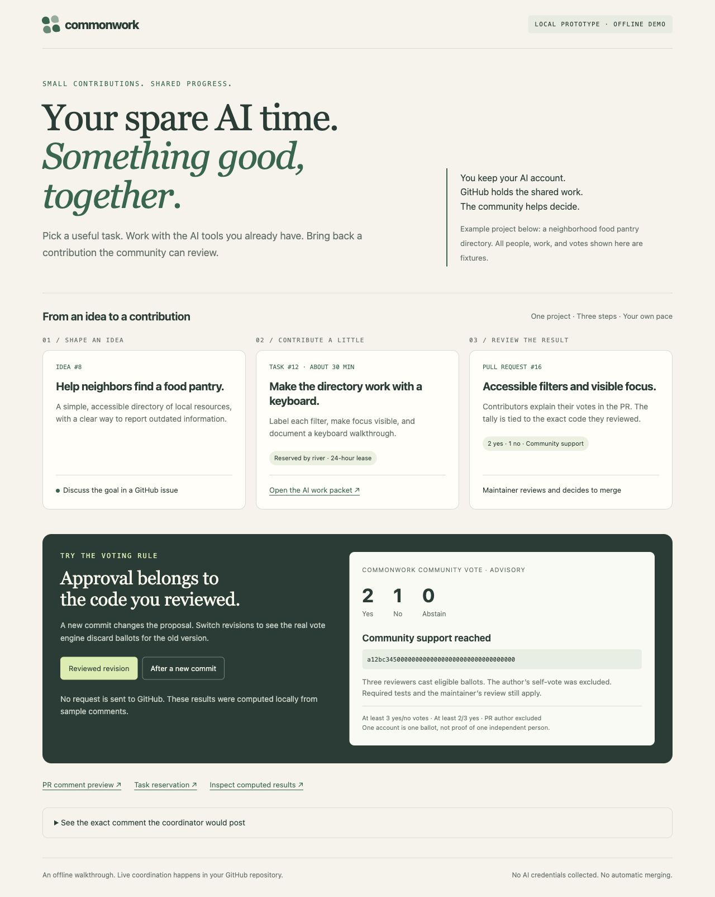

# Commonwork

Commonwork helps strangers build useful things together using GitHub and their own AI tools. People propose ideas, claim small tasks, submit pull requests, and vote inside those pull requests. Maintainers decide what gets merged.

“Donating spare AI capacity” means doing a task through your own authorized account and contributing the result. Commonwork does not pool tokens, collect AI credentials, run agents for you, or give strangers access to your computer.

This is an early prototype and repository starter, released under the [MIT License](LICENSE). Repository: [harrisonoconnorhover/commonwork](https://github.com/harrisonoconnorhover/commonwork). 54 automated tests pass. A [single-account GitHub smoke check](https://github.com/harrisonoconnorhover/commonwork/pull/2) verified task claims/releases, PR summaries, author-vote exclusion, and fresh-head updates. A real multi-contributor pilot remains unverified. See [HANDOFF.md](HANDOFF.md) for details.



## Try the offline example

Use Python 3.11 or later. There are no package dependencies to install. From this repository's root:

```sh
python3 -m commonwork demo
```

Open `demo-output/index.html` in a browser. The example also creates `work-packet.md`, `vote-summary.md`, and `results.json` in `demo-output/`. It shows a reservation, a vote with two yes ballots and one no, and votes becoming stale after a new commit. These are fixture results, not real contributions or GitHub activity. The demo uses no accounts, network, or AI tokens.

## How a contribution works

1. Discuss an idea in an issue titled `[Idea] …`.
2. Agree on a small deliverable and open a `[Task] …` issue with its goal, acceptance criteria, allowed files, and out-of-scope work. The included issue forms provide these fields; converting an idea into a task is a human decision.
3. Post `/claim` in the task issue. Read the coordinator's summary and expiration time to confirm who holds the reservation.
4. Export a work packet, choose your own time and AI budget, and work with your preferred assistant in your own environment.
5. Review the result, run relevant checks, and manually submit a pull request. Link it in the task issue and post `/release` when handing off.
6. Reviewers inspect the PR and post explained votes for its exact current commit. The bot summarizes support; a maintainer reviews and merges separately.

The coordinator reads comments and PR metadata. It never executes task descriptions or contributor code.

## Use it with a GitHub repository

The following commands assume a repository where the Commonwork coordinator has been installed. Replace `OWNER/REPO`, issue `12`, and PR `34` with actual values. Run commands from this checkout so `.commonwork/policy.json` is available.

```sh
python3 -m commonwork board --repo OWNER/REPO
python3 -m commonwork packet --repo OWNER/REPO 12 --output work-packet.md
python3 -m commonwork tally --repo OWNER/REPO 34
```

These commands read GitHub data; `packet` also writes the requested local file. Exporting a packet does not claim the task or start an AI tool. Public reads can work without authentication, subject to GitHub's rate limits.

For the following commands, authenticate with your own GitHub account through `gh auth login`, or provide `GH_TOKEN` through your normal secret handling. They **post comments to GitHub**:

```sh
python3 -m commonwork claim --repo OWNER/REPO 12
python3 -m commonwork release --repo OWNER/REPO 12
python3 -m commonwork vote --repo OWNER/REPO 34 yes \
  --sha 0123456789abcdef0123456789abcdef01234567 \
  --reason "I reviewed the changed routing rule and reproduced the documented checks."
python3 -m commonwork vote --repo OWNER/REPO 34 withdraw \
  --sha 0123456789abcdef0123456789abcdef01234567
```

The SHA above is an example. Replace it with the full 40-character commit you actually reviewed. The vote command refuses a SHA that no longer matches the current PR head. A posted request is not confirmation of a successful claim or an eligible vote; check the coordinator's result. Never put credentials in issues, packets, commits, or PRs.

Run `python3 -m commonwork --help` or add `--help` to any subcommand for its arguments. `sync-event` is reserved for the installed Actions workflow.

## Reservation rules

Use `/claim` or `/release` as the exact first line of a **new task comment**. The first eligible human claim gets a 24-hour reservation by default. Additional claims during that reservation are ignored, including repeats by its holder. Only the holder can release it. To renew, claim again after expiration, or release and then claim again; someone else can claim during that gap.

Edited command comments and bots are ignored. Deleting comments changes the reconstructed history, so leave claim and release comments unchanged. Reservations coordinate work; they do not enforce ownership or authorize spending or merging.

Expiration is calculated when the task is next read or an event is processed. There is no timer that edits the bot comment at the expiration instant. A local `board` read calculates fresh availability without updating GitHub; a subsequent coordinator event or manual refresh updates the posted summary. Always check its UTC expiration and recent comments.

## Voting rules

Post a comment directly in the PR conversation, with an exact command on its first line and an explanation on a following line:

```text
/vote yes 0123456789abcdef0123456789abcdef01234567

I reviewed this commit and checked the acceptance criteria described in the PR.
```

Choices are `yes`, `no`, `abstain`, and `withdraw`. The first three require an explanation; withdrawal does not. There is no standalone `/withdraw` command. Markdown quotations, indentation, or extra text on the command line do not count as ballots.

- Each eligible GitHub account gets one effective command, selected by comment update time, then comment ID. Bots and the PR author are excluded.
- A vote applies to its exact full head SHA. A newer valid vote for another commit supersedes the account's earlier vote but is stale for the current commit. New commits need fresh review and votes.
- A latest `withdraw` command removes the account's ballot, including when that withdrawal references an older SHA.
- Editing or deleting a command can reveal an older separate ballot. Post a new `/vote withdraw FULL_SHA` to withdraw explicitly.
- By default, support requires at least three decisive votes (`yes` + `no`), at least two-thirds yes, and strictly more yes than no. Abstentions count toward neither quorum nor the approval fraction. Two yes and one no reaches support; one yes and two abstentions does not.

The summary is **advisory**. It does not submit a GitHub approval, satisfy branch protection, or merge anything. One account is not one verified person, and these rules do not prevent someone using several accounts. Human-account ballots are not proof of independent human review.

Policy lives in [`.commonwork/policy.json`](.commonwork/policy.json). An empty `eligible_voters` list permits all otherwise eligible accounts; a nonempty list restricts voting to those GitHub logins. Logins can change. The deployed default-branch policy controls bot summaries. The CLI's local policy, including a file selected with `--policy`, is informational and does not change the remote coordinator.

## Install when the owner is ready

Before accepting contributions in your own repository, review the policy and install this starter's files there. Preserve its `.github` and `.commonwork` directories and put the workflows on the repository's default branch. If that branch is not `main`, adjust the test workflow's push branch filter.

The coordinator uses GitHub's built-in `GITHUB_TOKEN`; it needs no AI-provider secret or separately issued bot token. Its permissions are `contents: read`, `issues: write`, and `pull-requests: write`. Both comment surfaces need write permission: issue reservations use `issues: write`, and PR summaries use `pull-requests: write`. The first live test returned HTTP 403 on PR comments with read-only PR permission. Organization and repository Actions settings must permit those permissions and the applicable events. [GitHub token documentation](https://docs.github.com/en/actions/concepts/security/github_token)

The coordinator explicitly checks out trusted default-branch code with checkout credentials disabled. It reads the event JSON, validates the issue/PR number, and handles issue bodies and comments as data. Keep those values out of interpolated shell commands. Contributor tests use a separate `pull_request` workflow with a read-only token. [GitHub's security guidance](https://docs.github.com/en/actions/reference/security/securely-using-pull_request_target), [script injection guidance](https://docs.github.com/en/actions/concepts/security/script-injections)

As of October 2, 2026, GitHub documents its default public-repository `pull_request_target` policy as being in evaluate mode, with enforcement on November 2, 2026 for affected repositories. Review Actions policy insights before enabling automatic PR-event refresh. If that event is blocked, comment events can still refresh tallies when permitted, and an authorized maintainer can select **Actions → Commonwork coordinator → Run workflow**, choose the default branch, and enter the positive issue or PR number in `number`. Manual dispatch must also be allowed by the repository's policies. [Default event policy](https://docs.github.com/en/actions/reference/security/securely-using-pull_request_target#default-policy-for-pull_request_target), [workflow events](https://docs.github.com/en/actions/reference/workflows-and-actions/events-that-trigger-workflows#workflow_dispatch)

Before calling an installation ready, exercise a task claim, release, PR vote, edited/deleted vote, and new-head refresh on the actual repository. Suggested repository settings are protected default branches, required human PR approval, and required independent test checks. These settings have **not** been configured by this prototype. [Protected branches](https://docs.github.com/en/repositories/configuring-branches-and-merges-in-your-repository/managing-protected-branches/about-protected-branches)

See [CONTRIBUTING.md](CONTRIBUTING.md) for contribution steps and [docs/decisions.md](docs/decisions.md) for the design choices.
